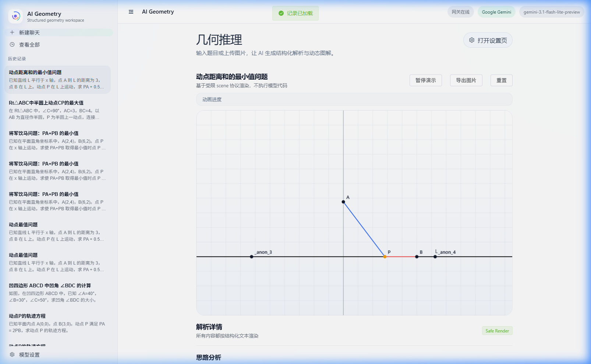

# GeometrySolver-Pro 📐


**GeometrySolver-Pro** 是一款基于逻辑驱动与人工智能的下一代几何沙箱引擎。它不仅仅是一个绘图工具，更是一个具备“几何头脑”的智能辅助教学系统，能够深度解析并动态演示复杂的初高中几何压轴题。

---

## 🌟 核心特性

### 1. 逻辑驱动的求解引擎 (Logic-Driven Solver)
不同于传统的视觉模拟，本项目采用基于公式的约束求解器。所有关键点（交点、中点、垂足）均由后端精确计算，确保几何定理在任何缩放比例下都绝对成立。

### 2. 37 类全场景学术模型集成
内置 37 类初高中核心几何模型，涵盖从基础全等到竞赛级定理：
- **压轴最值**：将军饮马、胡不归、费马点、米勒角等。
- **动点轨迹**：瓜豆模型、阿氏圆、九点圆等。
- **经典定理**：梅涅劳斯定理、塞瓦定理、西姆松线、托勒密定理等。
- **函数几何**：抛物线、反比例函数几何综合。

### 3. 专业级交互体验
- **动态时间轴**：支持手动拖动动画进度，精确观察动点轨迹演变。
- **高清导出**：一键导出高清 PNG 图件，助力教案与试卷制作。
- **学术排版**：全界面支持标准 LaTeX 数学公式渲染。
- **丝滑操控**：支持以鼠标为中心的平滑缩放 (Zoom) 与平移 (Pan)。

---

## 🛠️ 技术栈

- **Frontend**: Vue 3 + Vite + Element Plus + Pinia
- **Backend**: Python 3.10+ + FastAPI + aiosqlite
- **AI Engine**: Google Gemini 1.5 Flash / Pro (支持自定义 OpenAI 兼容接口)
- **Rendering**: HTML5 Canvas + KaTeX

---

## 🚀 快速开始

### 1. 克隆项目
```bash
git clone https://github.com/kezunwei2026/GeometrySolver-Pro.git
cd GeometrySolver-Pro
```

### 2. 后端配置
1. 进入 `app/backend` 目录。
2. 创建 `.env` 文件，填入您的 API KEY：
   ```env
   GEMINI_API_KEY=your_api_key_here
   GEMINI_MODEL=gemini-3.1-flash-lite-preview
   ```
3. 安装依赖：`pip install -r requirements.txt`
4. 运行后端：`python main.py`

### 3. 前端启动
1. 进入 `app/frontend` 目录。
2. 安装依赖：`npm install`
3. 启动开发服务器：`npm run dev`

---

## 📸 预览



## 📄 开源协议
MIT License
